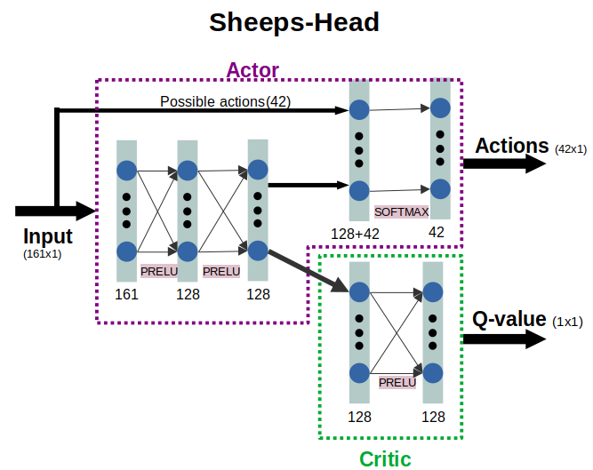
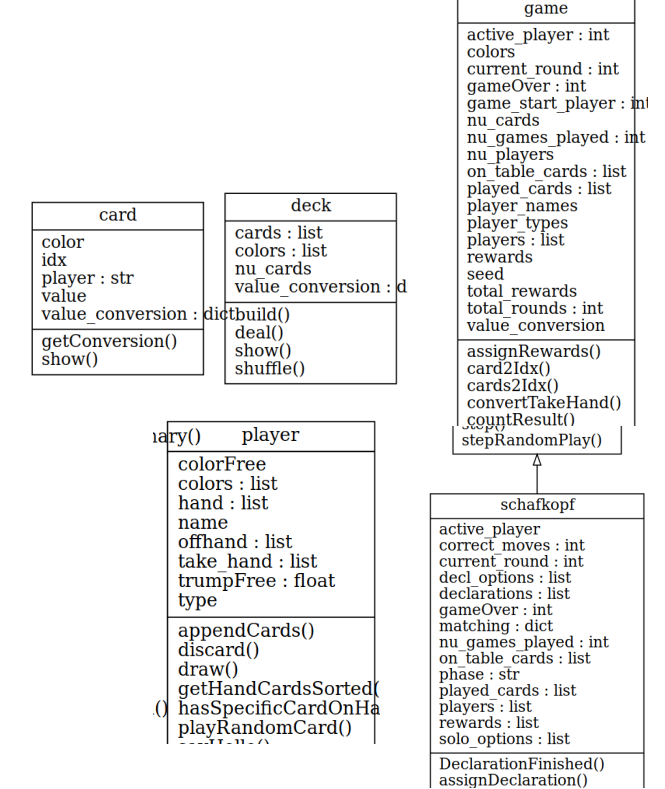

This repro contains a python gym environment for the card game schafkopf (sheep head).

In order to test the gym as well as training a Neuronal Network using Proximal Policy Optimization check the **Tutorials**.

You can play and test your trained neuronal network at **https://idgaming.de/**.

## Rules of Schafkopf
* Regeln sehr ähnlich wie hier: https://www.schafkopfschule.de/files/inhalte/dokumente/Spielen/Regeln/Schafkopfregeln-Aktuell-29.3.2007.pdf
* Langer (8 Karten):
  * Ramsch, Solo (Farbe, Wenz, Geier), Hochzeit, Ruf, Bettel, Aufgelegter Bettel, Solo Du
  * Herz ist Trumpf bei Bettel, Hochzeit, Ruf, Ramsch
  * Herz ass kann niemals gerufen werden
  * Hochzeit ist nicht höher als Solo!
  * Ruf ass muss immer gelegt werden außer:
    + Wenn der Mitspieler mindestens vier Karten mit der Ruf-Sau in der Ruf-Farbe besitzt, kann er davonlaufen (unter der Ruf-Sau ausspielen), solange die Farbe noch nicht gespielt war und er noch alle vier Farbkarten in der Hand hält.
    + Nachdem die Ruf-Farbe bereits einmal gespielt war (und durch Davonlaufen nicht zugegeben wurde), kann die Ruf-Sau gespielt oder geschmiert werden. Wurde die Ruf-Sau nicht gesucht, so darf sie erst im letzten, dem 8. Stich, zugegeben werden. Der Mitspieler, der die Ruf-Sau hat, kann diese zu jedem Zeitpunkt anspielen, sofern er an der Reihe ist.

## Kosten
* Normal(5), Schneider(+5extra), Schneider-Schwarz(+10extra)
* Solo: 15
* Bettel: 10
* Hochzeit: (Ergebnis x2)
* Laufende (ab 3 Ober)
* Ramsch: (einer zahlt alles, bei mehreren verlierern aufgeteilt, wenn alle gleich kostet 0

## Ablauf
* Declarations
* phase1: weg, solo, bettel, ruf, hochzeit
* phase2: ramsch (wenn alle), solo=(farbe, geier, wenz), ruf(mit wem?)

## Installation
```bash
git clone git@github.com:CesMak/gym_schafkopf.git
sudo apt install python-pip
sudo apt install python3-venv
python3 -m venv gym_env
source gym_env/bin/activate
pip3 install -r requirements.txt # the requirements.txt file is in the Tutorials folder
```

## State Representation
* state = np.asarray([on_table+ on_hand+ played+ play_options+ add_states+matching+decl_options+[self.active_player]])
* Example for 8 Cards and 4 Players
* Total Cards = 32
  * Each card has a color **E**ichel, **G**ruen, **H**erz, **S**chelle
  * A value: 7, 8, 9, **U**nter, **O**ber, **K**ing, 10, **A**ss
  * An index: 0...31
  * All cards sorted by index are:
  ```
  [7 of E_0, 8 of E_1, 9 of E_2, U of E_3, O of E_4, K of E_5, 10 of E_6, A of E_7, 7 of G_8, 8 of G_9, 9 of G_10, U of G_11, O of G_12, K of G_13, 10 of G_14, A of G_15, 7 of H_16, 8 of H_17, 9 of H_18, U of H_19, O of H_20, K of H_21, 10 of H_22, A of H_23, 7 of S_24, 8 of S_25, 9 of S_26, U of S_27, O of S_28, K of S_29, 10 of S_30, A of S_31]
  ```
* on_table, on_hand, played, play_options = 32x1 binary vector
  * e.g. play_options
  ```
  Options Max: [U of E_3, O of E_4, 7 of G_8, K of G_13, 10 of G_14, U of H_19, 7 of S_24, O of S_28]
  Vector list: [0, 0, 0, 1, 1, 0, 0, 0, 1, 0, 0, 0, 0, 1, 1, 0, 0, 0, 0, 1, 0, 0, 0, 0, 1, 0, 0, 0, 1, 0, 0, 0]
  ```
  * 1 means this card is available as option
* The state for a player is given as:
  * card_state = on_table+ on_hand+ played+ play_options (4*32x1) = 128x1
  * add_states = [would win(1x1), colorfree(4x1), trumpfree(1x1)] (4*6x1) (3=for each other player than current) = 18x1  
    * would win is only 1 for the other player that would win the current stich
  * matching   = (4x1)
    * active player = 0  and matching = [1, 0, 1, 0]
    * this means active player is in the team with itself and player 2
  * state(150x1)=card_state + add_states+matching+decl_options

**TODO decl_options** ist fuer zustand gar nicht noetig oder?! was soll der damit machen?!
-> doch sonst weiß man gar nicht was wer gemacht hat? Oder muss man das auch nicht?
-> teste es aus ob man das nicht weglassen kann!

## Action Space
* playOptions (cards 32)
* declarations (ordered) = "weg", "ruf_E", "ruf_G", "ruf_S", "wenz", "geier", "solo_E", "solo_G", "solo_H", "solo_S"
* action_space = playOptions + declarations = 42

## Install gym environment
```bash
cd gym
pip install -e .
```

## Tutorials
In order to successful run the tutorials make sure to install the requirements.txt file:
```bash
pip3 install -r requirements.txt # the requirements.txt file is in the Tutorials folder
```

### 00_GameLogicTests

Simply run the unittests to test the gameLogic of Schafkopf:

```bash
/gym_schafkopf/gym-schafkopf/gym_schafkopf$ python gameLogicTests.py
```

### 01_GenerateGymData

```bash
/01_Tutorials/01_GenerateGymData$ python test_gym.py
```
shows how the gym is used:
+ step(actions(0...42))
+ -> returns the rewards

### 02_GenerateBatches

Generate Data which is used later on to train a policy.
```bash
/01_Tutorials/02_GenerateBatches$ python gen_batches.py
```

This example shows how to generate a lot of data that can then be used for offline learning!

```
Creating model: Schafkopf-v1
Model state  dimension: 161 
Model action dimension: 42
Number of steps in one game: 10 


One Batch:
Actions: [36]
State  : [array([0, 0, 0, 0, 0, 0, 0, 0, 0, 0, 0, 0, 0, 0, 0, 0, 0, 0, 0, 0, 0, 0,
       0, 0, 0, 0, 0, 0, 0, 0, 0, 0, 0, 0, 0, 0, 0, 0, 0, 1, 0, 0, 0, 0,
       0, 0, 0, 1, 1, 0, 1, 1, 0, 1, 0, 0, 1, 0, 0, 0, 0, 0, 0, 1, 0, 0,
       0, 0, 0, 0, 0, 0, 0, 0, 0, 0, 0, 0, 0, 0, 0, 0, 0, 0, 0, 0, 0, 0,
       0, 0, 0, 0, 0, 0, 0, 0, 0, 0, 0, 0, 0, 0, 0, 0, 0, 0, 0, 0, 0, 0,
       0, 0, 0, 0, 0, 0, 0, 0, 0, 0, 0, 0, 0, 0, 0, 0, 0, 0, 1, 0, 0, 0,
       0, 0, 1, 0, 0, 0, 0, 0, 1, 0, 0, 0, 0, 0, 0, 0, 0, 0, 1, 0, 0, 0,
       1, 1, 1, 1, 1, 1, 1])]
Rewards: [0]
LogProb: [0.2]
Done   : [False]
State: 161
State for Lea
         on_table 32 []
         on_hand 32 [u"EA", u"GA", u"H7", u"H9", u"HU", u"HK", u"S7", u"SA"]
         played 32 []
         options 32 []
         partners: Lea_1(you) play with 
         Add_state for  Max
                  would_win 1 is free of trump 0 color(EGHZ) free [0 0 0 0]
         Add_state for  Jo
                  would_win 1 is free of trump 0 color(EGHZ) free [0 0 0 0]
         Add_state for  Tim
                  would_win 1 is free of trump 0 color(EGHZ) free [0 0 0 0]
         Declaration options ['weg', 'wenz', 'geier', 'solo_E', 'solo_G', 'solo_H', 'solo_S'] [1 0 0 0 1 1 1 1 1 1]
None

Benchmark playing 100000 steps
Took: 0:00:19.006270 Number of batches:  19269 ## TODO there are a lot of steps not working?!
```

### 03_Parallel_Batch_Generation
* uses ray for parallel batch generation
* pip install ray==0.8.1
* is 2.5xfaster
```bash
/01_Tutorials/03_Parallel_Batch_Generation$ python gen_batches_parallel.py.py
```

```
Creating model: Schafkopf-v1
Model state  dimension: 155
Model action dimension: 36

Benchmark playing 10000 games
Took: 0:00:29.501962 Number of batches:  99925
```

### 04_Policy_PPO

The PPO contains the following actor-critic:


* include training a neuronal network
* included classes ActorModel, ActorCritic, PPO
```bash
pip install torch
pip install onnx
pip install onnxruntime
```

* As you can see in the output below the batch size is slowly increasing
* The learning rate (lr) remains constant
* The network learns slowly correct actions (playing correct cards)

```bash
/01_Tutorials/04_Policy_PPO$ python ppo_policy.py.py
```

Output:
```
Creating model: Schafkopf-v1
Model state  dimension: 155
Model action dimension: 36
Parameters for training:
 Latent Layers: 128
 Learing Rate: 0.01  betas  (0.9, 0.999)
 Gamma:  0.99
 Epochs to train:  16
 Epsillon 0.2  decay:  266
 Batch size: 3000 Increase Rate: 10 0


Game ,0030000, mean_rew of 0 finished g. ,0.0, of random ,0.0, corr_moves[max: 9] ,0.3096, mean_rew ,-1e+02,   0:01:02.645053,playing t=42.32, lr=0.01, batch=29930
Game ,0090300, mean_rew of 0 finished g. ,0.0, of random ,0.0, corr_moves[max: 9] ,1.123, mean_rew ,-1e+02,   0:03:16.859169,playing t=47.68, lr=0.01, batch=60187
Game ,0151000, mean_rew of 0 finished g. ,0.0, of random ,0.0, corr_moves[max: 9] ,1.341, mean_rew ,-1e+02,   0:05:45.887274,playing t=47.8, lr=0.01, batch=60604
Game ,0212100, mean_rew of 0 finished g. ,0.0, of random ,0.0, corr_moves[max: 9] ,1.874, mean_rew ,-1e+02,   0:08:31.161221,playing t=51.53, lr=0.01, batch=61014
...

Hand of player:  Max [O of E_4, K of E_5, 9 of G_10, O of G_12, O of H_20, A of H_23, U of S_27, K of S_29]
Hand of player:  Lea [7 of E_0, 10 of E_6, U of G_11, 9 of H_18, U of H_19, 10 of H_22, 7 of S_24, A of S_31]
Hand of player:  Jo [U of E_3, A of G_15, 7 of H_16, 8 of H_17, K of H_21, 8 of S_25, O of S_28, 10 of S_30]
Hand of player:  Tim [8 of E_1, 9 of E_2, A of E_7, 7 of G_8, 8 of G_9, K of G_13, 10 of G_14, 9 of S_26]
Lea RL trys to declare.... 32  allowed is [1.0, 1.0, 0.0, 0.0]
	 Lea: weg
Jo RANDOM 2 trys to declare.... 32
	 Jo: weg
Tim RANDOM 3 trys to declare.... 32
	 Tim: weg
Max RANDOM 0 trys to declare.... 32
	 Max: weg
	 Highest Declaration: ('weg', 0)
	 Matching           :  {'type': 'ramsch', 'partner': 2, 'spieler': 0, 'trump': 'H',


0 1-Lea	RL	plays U of H_19
0 2-Jo	RANDOM	plays 7 of H_16
0 3-Tim	RANDOM	plays A of E_7
0 0-Max	RANDOM	plays O of E_4
	 Winner:Max with O of E_4 sits on 3 at the table

1 0-Max	RANDOM	plays O of G_12
1 1-Lea	RL	plays 9 of H_18
1 2-Jo	RANDOM	plays U of E_3
1 3-Tim	RANDOM	plays 7 of G_8
	 Winner:Max with O of G_12 sits on 0 at the table

2 0-Max	RANDOM	plays O of H_20
2 1-Lea	RL	plays 10 of H_22
2 2-Jo	RANDOM	plays K of H_21
2 3-Tim	RANDOM	plays 8 of E_1
	 Winner:Max with O of H_20 sits on 0 at the table

3 0-Max	RANDOM	plays K of S_29
3 1-Lea	RL	plays A of S_31
3 2-Jo	RANDOM	plays 10 of S_30
3 3-Tim	RANDOM	plays 9 of S_26
	 Winner:Lea with A of S_31 sits on 1 at the table

4 1-Lea	RL	plays 10 of E_6
4 2-Jo	RANDOM	plays 8 of H_17
4 3-Tim	RANDOM	plays 9 of E_2
4 0-Max	RANDOM	plays K of E_5
	 Winner:Jo with 8 of H_17 sits on 1 at the table

5 2-Jo	RANDOM	plays O of S_28
5 3-Tim	RANDOM	plays 8 of G_9
5 0-Max	RANDOM	plays A of H_23
5 1-Lea	RL	plays U of G_11
	 Winner:Jo with O of S_28 sits on 0 at the table
6 2-Jo	RANDOM	plays A of G_15
6 3-Tim	RANDOM	plays K of G_13
6 0-Max	RANDOM	plays 9 of G_10
6 1-Lea	RL	plays 7 of S_24
	 Winner:Jo with A of G_15 sits on 0 at the table
7 2-Jo	RANDOM	plays 8 of S_25
7 3-Tim	RANDOM	plays 10 of G_14
7 0-Max	RANDOM	plays U of S_27
7 1-Lea	RL	plays 7 of E_0
	 Winner:Max with U of S_27 sits on 2 at the table
{'state': 'playing', 'ai_reward': 12, 'on_table_win_idx': 2, 'trick_rewards': [12, 0, 0, 0], 'player_win_idx': 0, 'final_rewards': array([50., 25., 45.,  0.])} 9 True

Final ai reward: [25.0, 31.666666666666668] moves 9 done True
Game ,1941100, mean_rew of 4594 finished g. ,3.2889, of random ,2.0716, corr_moves[max: 9] ,8.605, mean_rew ,-5.1,   2:35:56.407277,playing t=96.07, lr=0.01, batch=71219
Game ,2013000, mean_rew of 4366 finished g. ,3.4246, of random ,1.9139, corr_moves[max: 9] ,8.458, mean_rew ,-9.69,   2:41:58.271590,playing t=98.85, lr=0.01, batch=71460
Game ,2085300, mean_rew of 4488 finished g. ,2.5938, of random ,2.1137, corr_moves[max: 9] ,8.523, mean_rew ,-7.91,   2:48:04.383976,playing t=100.17, lr=0.01, batch=71909
Game ,2158000, mean_rew of 4542 finished g. ,2.6856, of random ,2.0668, corr_moves[max: 9] ,8.569, mean_rew ,-6.72,   2:54:10.895498,playing t=99.86, lr=0.01, batch=72329
Game ,2231100, mean_rew of 4576 finished g. ,3.1993, of random ,2.2232, corr_moves[max: 9] ,8.576, mean_rew ,-5.55,   3:00:19.230973,playing t=100.97, lr=0.01, batch=72772
```


### 05_ImprovePretrained
* use pretrained network and improve it!
* params further_1:
  ```
  eps = 0.05               #train further1: 0.05   train further2: 0.01 train further3:  0.001
  lr  = 0.001              #train further1: 0.001  train further2: 0.0009, train further3 0.0001
  update_timestep = 5000  # train further1: 80000  train further2: 180000  train further2: 300000
  eps_decay   = 8000000 # is currently not used!
  ```

```bash
/01_Tutorials/05_ImprovePretrained$ python policy_ppo.py
```

Output:
```
```

## Further Notes
```bash
pip freeze > requirements.txt
# to export class model graph:
#sudo apt install pylint
pyreverse -o png gameClasses.py schafkopf.py
```

## General gym design
* gym-schafkopf/gym_schafkopf/envs contains:
 * schafkopf_env.py: contains basic functions (reset, step) required for batch generation
 * gameClasses.py
    + contains class card
    + contains class deck
    + contains class player
    + contains class game
 * schafkopf.py: inherits from game
 * gameLogicTests: contains unitTest to test the functionality of the other classes.



## Changelog
|Date|Description|commit|
|-|---------|-|
|2020.08.14| | init  |
|2020.08.14| | testing_random_playing  |
|2020.08.14| included_declarations see gameLogicTests | included_declarations  |
|2020.08.14| included rewarding and final money for ruf | added_money_ruf  |
|2020.08.14| included trump free| added_trump_free  |
|2020.09.06| added more testes and fixed game Logic bugs | fixed_gameLogic_Bugs  |
|2020.09.07| added test_color free test | added_color_test  |
|2020.09.07| added printStatetest|   |
|2020.09.08| included declarations in env environment| env_step1   |
|2020.09.08| included playing phase in env environment| env_step2  |
|2020.09.08| 8/8gameLogicTests run without error | env_step3  |
|2020.09.10| added tut2 and included cp in state | included_cp_in_state  |
|2020.09.10| added tut3 started with tut4 | added_tutorial3  |
|2020.09.10| added test test_playUntilAI| test_playUntilAI  |
|2020.09.11| added test test_playUntilAI| test_playUntilAI_2  |
|2020.09.11| added tut4| added_tut4_learn1  |
|2020.09.11| added tut5| added_tut5_learnfurther |
|2020.09.11| added test_ramsch| test_ramsch |
|2020.09.14| added classes| improved_readme |

Correct logic errors.....
TODO teste ob checkt mit wem zusammenspielt....
next: how to integrate schafkopf in the webpage?
Denke drueber nach ob decl options ueberhaupt wichtig ist?!

Siehe:
https://www.mikoweb.eu/?p=1474
https://www.mikoweb.eu:8080/skr/zumspiel.html
